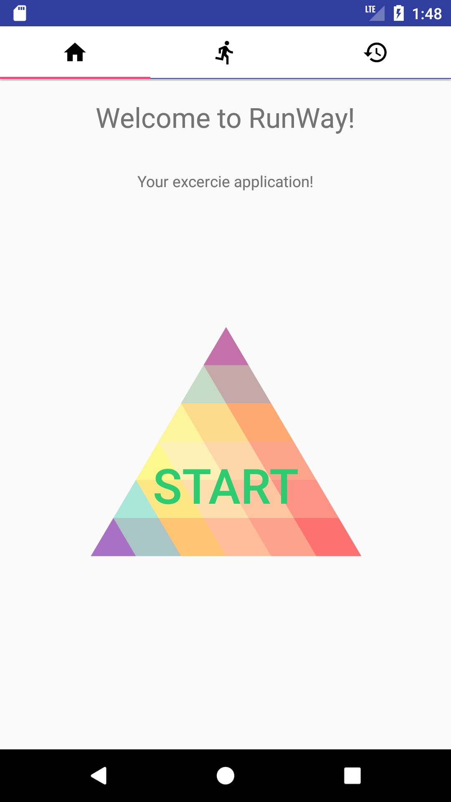
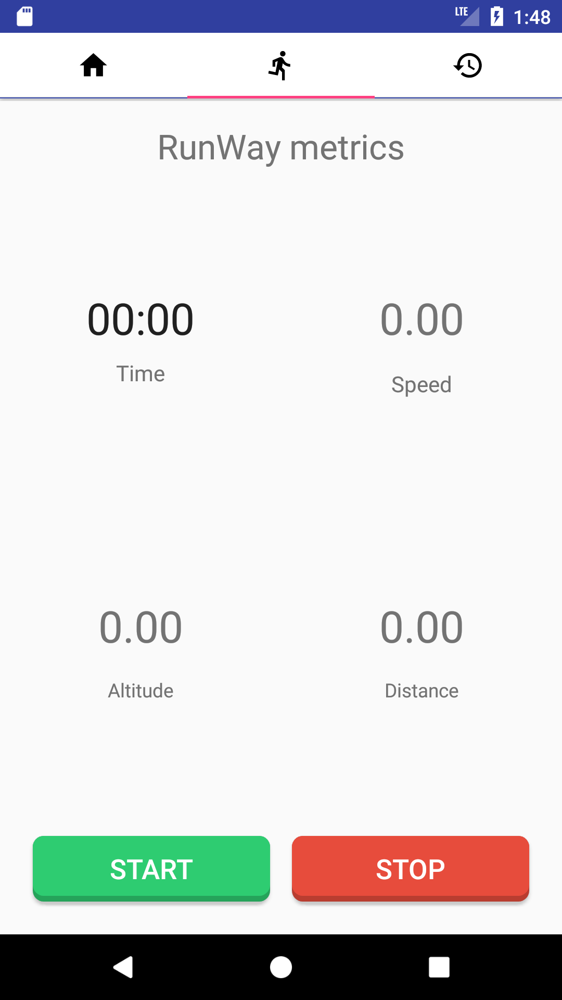

# RunWay
Runway is an exercise application, developed while taking a course at Umeo University in Sweden. The application does not save running related data persistently. This application is more of a proof of concept rather than a finished product.

## Here are some images
### Accept the required permissions

### Start fragment

### Statistics fragment

### History fragment

